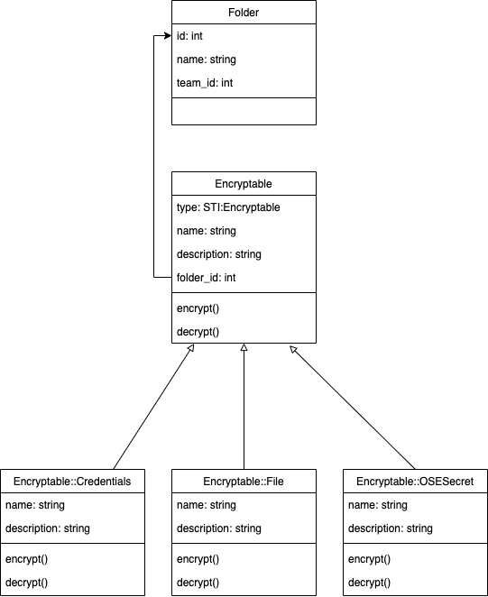

# Encryptables Model

## Ausgangslage

Das Encryptabels Model soll die neue Struktur für die Realisierung mehrerer verscheidener Encryptables Typen sein.
Encryptables sind flexibel und sind direkt an Ordner angehängt, wie es aktuell die Accounts sind.

## Anforderungen

Die Benutzer sollen nicht nur Ihre Accounts, sondern auch Ihre PINs, Tokens, Zertifikate und Secrets ablegen können.
Vorrausetzung dazu ist eine klare Abgrenzung im Code. Damit diese gewährleistet ist, werden die Encryptables Models nach
einer klaren Hierarchie aufgebaut.

## Verschlüsselung

Die Benutzerdaten der encryptables werden mit `AES256CBC` verschlüsselt, welches einen iv (initialization vector) wert
Bietet. Dieser iv Wert wird der Verschlüsselung beigefügt. Folglich verstärkt dies die Verschlüsselung. Konkret betrifft
dies das `data` Attribut, in welchem sich die sensiblen Daten befinden.

## Model Klassendiagramm


_Klassendiagramm mit neuer encryptables Struktur._

### Beschreibung

Das Encryptable ist die Oberstruktur, folglich die Baseclass.. Alle weiteren Encryptable Typen wie z.B. das File oder
die Credentials werden diese Klasse vererben. Dadurch wird eine Single Table Inhertiance erstellt. Damit diese
Funktioniert, erhält die Encryptable Baseclass ein Attribut `type`, dieses definiert infolgedessen, in den Subklassen
den jeweiligen Encryptable Typ.

| Attribut                | Beschreibung                                                                                                                                                                       |
| ----------------------- |:----------------------------------------------------------------------------------------------------------------------------------------------------------------------------------:|
| `name`                  | Der Name des Aktuellen Encryptable. Kann beispielsweise das Google Konto oder der API Key für einen Online service sein.                                                           |
| `description`           | Die Beschreibung des Encryptable, enthält typischerweise weitere Informationen.                                                                                                    |
| `type`                  | Definiert in den Subklassen den Encryptable typ. `Wird Encryptable::File`, `Encryptable::Credentials` oder `Encryptable::OSESecret` sein.                                          |
| `folder_id`             | Diese definiert den Ordner, welchem das Encryptable untergeordnet ist.                                                                                                             |
| `encrypted_data`        | Dieses Attribut beinhaltet die sensiblen Benutzerdaten. Dabei gibt es drei Typen welche verschlüsselt werden. siehe [verschlüsselung](#verschlsselung) und [data](#data-attribut). |

#### `encrypt(team_password)`
Diese Methode verschlüsselt die Daten welche sich im Account befinden. Konkret werden die cleartext Daten aus der jeweiligen Tabelle entnommen, je nach encryptable `base64` codiert und danach verschlüsselt.

#### `decrypt(team_password)`


## Encryptable::Credentials

Dieses Encryptable sieht vor, Daten in einem Key-Value Set zu verschlüsseln. Dies wird mithilfe
von `EncryptedData::Credentials` gemacht.

# ECHTE WERTE IM JSON

```json lines
[
  {
    encrypted_value: 'base64encryptedvalue',
    attribute_name: 'username',
    iv: 'base64-encoded-iv',
  },
  {
    label: 'Cryptopus Schlüssel',
    attribute_name: 'custom',
    encrypted_value: 'base64encryptedvalue',
    iv: 'base64-encoded-iv',
  }
]
```

## Encryptable::File

Dieses Encryptable sieht vor, Dateien welche base64 encoded sind, zu verschlüsseln. Dies wird mithilfe
von `EncryptedData::Credentials` gemacht.

```json lines
{
  encrypted_value: 'base64encryptedvalue',
  attribute_name: 'username',
  iv: 'base64-encoded-iv',
}
```

## Encryptable::OSESecret

Dieses Encryptable sieht vor, Daten in einem Key-Value Set zu verschlüsseln. Dies wird mithilfe
von `EncryptedData::File` gemacht.

```json lines
{
  encrypted_value: 'base64encryptedvalue',
  attribute_name: 'username',
  iv: 'base64-encoded-iv',
}
```


