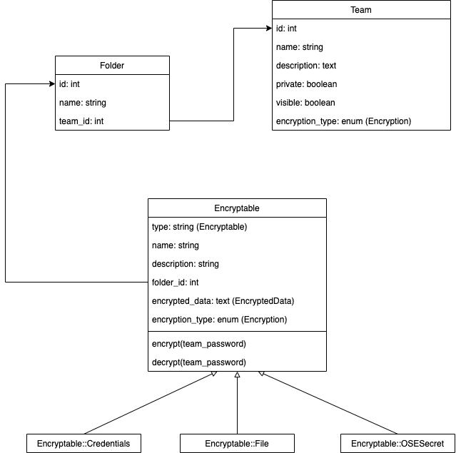

# Encryptables Model

Das neue Modell **Encryptable** dient als Container für alle sensitiven Benutzerdaten und ersetzt die heutigen Models wie Account und FileEntry.

## Anforderungen

Die Benutzer sollen nicht nur Ihre Accounts, sondern auch Ihre PINs, Tokens, Zertifikate usw. ablegen können.
Vorrausetzung dazu ist eine klare Abgrenzung im Code. Damit diese gewährleistet ist, werden die Encryptables Models nach
einer klaren Hierarchie aufgebaut.

## Verschlüsselung

Heute werden die Daten mitels dem komplexen Teampasswort sowie dem Algorithmus `AES256CBC` verschlüsselt in der Datenbank gespeichert. Mit der Einführung von Encryptables soll die Verschlüsselung noch zusätzlich mit je einem IV (initialization vector) ergänzt werden. Konkret betrifft dies das `encrypted_data` Attribut von **Encryptable**, in welchem sich die sensiblen Daten befinden.

## Model Klassendiagramm



_Klassendiagramm mit neuer encryptables Struktur._

### Beschreibung

Encryptable ist die Baseclass, alle weiteren Encryptable Typen wie z.B. das File oder
die Credentials werden diese Klasse vererben. Dadurch wird eine Single Table Inhertiance erstellt. Damit diese
Funktioniert, erhält die Encryptable Baseclass ein Attribut `type`, dieses definiert infolgedessen, in den Subklassen
den jeweiligen Encryptable Typ.

| Attribut                | Beschreibung                                                                                                                                                                       |
| ----------------------- |:----------------------------------------------------------------------------------------------------------------------------------------------------------------------------------:|
| `name`                  | Der Name des Aktuellen Encryptable. Kann beispielsweise das Google Konto oder der API Key für einen Online service sein.                                                           |
| `description`           | Die Beschreibung des Encryptable, enthält typischerweise weitere Informationen. Wird *unverschlüsselt* in der DB gespeichert, zwecks suchfunktion.                                 |
| `type`                  | Definiert in den Subklassen den Encryptable typ. `Wird Encryptable::File`, `Encryptable::Credentials` oder `Encryptable::OSESecret` sein.                                          |
| `folder_id`             | Diese definiert den Ordner, welchem das Encryptable untergeordnet ist.                                                                                                             |
| `encrypted_data`        | Dieses Attribut beinhaltet die sensiblen Benutzerdaten. Dabei gibt es drei Typen welche verschlüsselt werden. siehe [verschlüsselung](#verschlsselung) und [data](#data-attribut). |

#### `encrypt(team_password)`
Diese Methode verschlüsselt die Daten welche sich im Account befinden. Konkret werden die cleartext Daten aus der jeweiligen Tabelle entnommen, je nach encryptable `base64` codiert und danach verschlüsselt.

#### `decrypt(team_password)`
Diese Methode entschlüsselt die Daten, die in der Datenbank als `base64` codiert und verschlüsselt wurden. Zurück

## Encryptable::Credentials

Dieses Encryptable sieht vor, Daten in einem Key-Value Set zu verschlüsseln. Dies wird mithilfe
von `EncryptedData::Credentials` gemacht. Der hauptsächliche Anwendungszweck dieses Encryptables ist es, Accountdaten welche eigens erstellte Attribute enthalten zu verwalten.

```json lines
[
  {
    encrypted_value: 'M0sr5dVu7txUFrSOdBClbgTq5VatTCTEoZc9q7HXtHvKds6kIKoeMwleAtLdpq/l9ZwlXwVLYuYwqBbeuYm2Pk0IW7vn+knnN6BFM8868m7xj8Y/3/MF/ap5THIjEGJePsA6mdsajYGYFJpi59pcUNernxzj5sOXZn4DPPLNZ5Lh7xr3D9dl06vLF0Pk13Kts3gmsB5PFuDiEd2igOdYKkLvLtZGUadmiE1D3gcWblevFYdV/Cwo8owdK3DR3MnJUK6IYgUVF/NHdbACqgfhpX+qOXINSHE56rHE90FwRiFC7QZdTpP7POD1HPJ7aFTeev0zuCvDoQIs9YMmY9Dc+A==',
    attribute_name: 'username',
    iv: '\x91;|\xB76e\x17\xA4s\xD5ul\xE8\xC8\xEB\x91',
  },
  {
    label: 'Cryptopus Schlüssel',
    attribute_name: 'custom',
    encrypted_value: 'M0sr5dVu7txUFrSOdBClbgTq5VatTCTEoZc9q7HXtHvKds6kIKoeMwleAtLdpq/l9ZwlXwVLYuYwqBbeuYm2Pk0IW7vn+knnN6BFM8868m7xj8Y/3/MF/ap5THIjEGJePsA6mdsajYGYFJpi59pcUNernxzj5sOXZn4DPPLNZ5Lh7xr3D9dl06vLF0Pk13Kts3gmsB5PFuDiEd2igOdYKkLvLtZGUadmiE1D3gcWblevFYdV/Cwo8owdK3DR3MnJUK6IYgUVF/NHdbACqgfhpX+qOXINSHE56rHE90FwRiFC7QZdTpP7POD1HPJ7aFTeev0zuCvDoQIs9YMmY9Dc+A==',
    iv: '\x91;|\xB76e\x17\xA4s\xD5ul\xE8\xC8\xEB\x91',
  }
]
```

## Encryptable::File

Dieses Encryptable sieht vor, Dateien welche base64 encoded sind, zu verschlüsseln. Dies wird mithilfe
von `EncryptedData::Credentials` gemacht.

```json lines
{
  iv: '\x91;|\xB76e\x17\xA4s\xD5ul\xE8\xC8\xEB\x91',
  value: 'M0sr5dVu7txUFrSOdBClbgTq5VatTCTEoZc9q7HXtHvKds6kIKoeMwleAtLdpq/l9ZwlXwVLYuYwqBbeuYm2Pk0IW7vn+knnN6BFM8868m7xj8Y/3/MF/ap5THIjEGJePsA6mdsajYGYFJpi59pcUNernxzj5sOXZn4DPPLNZ5Lh7xr3D9dl06vLF0Pk13Kts3gmsB5PFuDiEd2igOdYKkLvLtZGUadmiE1D3gcWblevFYdV/Cwo8owdK3DR3MnJUK6IYgUVF/NHdbACqgfhpX+qOXINSHE56rHE90FwRiFC7QZdTpP7POD1HPJ7aFTeev0zuCvDoQIs9YMmY9Dc+A==',
}
```

## Encryptable::OSESecret

Dieses Encryptable sieht vor, Daten in einem Key-Value Set zu verschlüsseln. Dies wird mithilfe
von `EncryptedData::File` gemacht.

```json lines
{
  iv: '\x91;|\xB76e\x17\xA4s\xD5ul\xE8\xC8\xEB\x91',
  value: 'M0sr5dVu7txUFrSOdBClbgTq5VatTCTEoZc9q7HXtHvKds6kIKoeMwleAtLdpq/l9ZwlXwVLYuYwqBbeuYm2Pk0IW7vn+knnN6BFM8868m7xj8Y/3/MF/ap5THIjEGJePsA6mdsajYGYFJpi59pcUNernxzj5sOXZn4DPPLNZ5Lh7xr3D9dl06vLF0Pk13Kts3gmsB5PFuDiEd2igOdYKkLvLtZGUadmiE1D3gcWblevFYdV/Cwo8owdK3DR3MnJUK6IYgUVF/NHdbACqgfhpX+qOXINSHE56rHE90FwRiFC7QZdTpP7POD1HPJ7aFTeev0zuCvDoQIs9YMmY9Dc+A=='
}
```

## EncryptedData
Die `EncryptedData` stellen sicher, dass Daten ver- und entschlüsselt werden und per JSON in der Datenbank abgelegt werden. Es wird empfohlen für jeden Key, welchen verschlüsselt

### EncryptedData::Credentials
Diese EncryptedData Klasse speichert die Daten mittels Key-Value set in der Datenbank ab. Dabei gilt zu beachten, dass jedes JSON object einen eigenen iv enthält. Dies verbessert die Verschlüsselungsstärke.

### EncryptedData::OSESecret
Diese Klasse nimmt `yaml` Dateien in form eines OSESecret, codiert sie als `base64` und speichert dieses wie die `EncryptedData::Credentials` Klasse mithilfe eines iv Werts verschlüsselt in der Datenbank ab.
