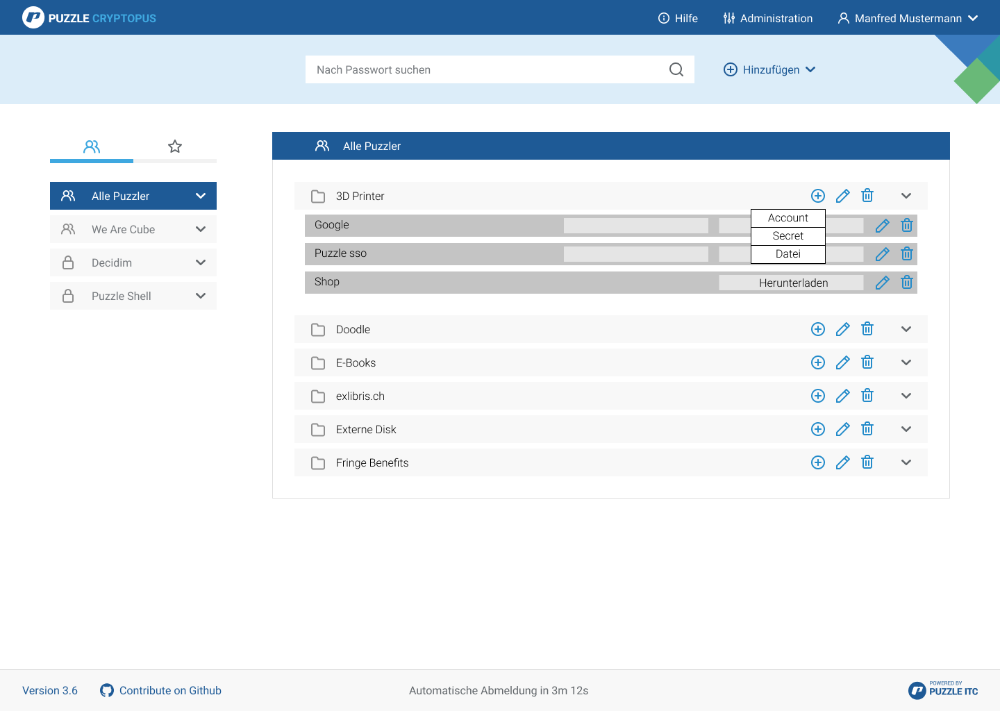
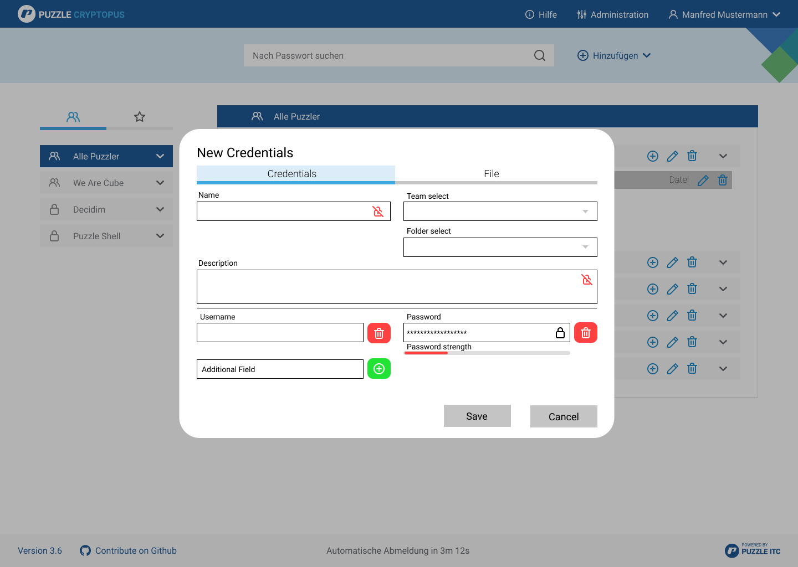
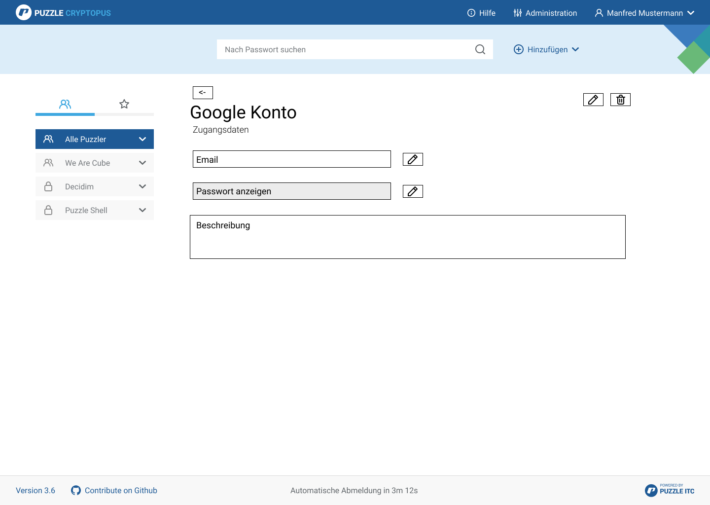

# Frontend Änderungen

## Ausgangslage
Durch die Änderungen welche im Backend bezüglich der encryptables vorgenommen werden müssen, muss auch das Frontend angepasst werden. Vorallem betrifft dies die Ansicht zum erstellen neuer encryptables sowie die Listenansicht.

## Anpassungen

### Listenansicht
Damit man im UI die neuen Encryptables erstellen kann, verwendet man wie bisher den (+) Button und das Fenster zum erstellen eines neuen encryptable öffnet sich. In einer Listenansicht werden alle encryptables zum dazugehörigen Ordner aufgelistet. Dies wird ähnlich der aktuellen Account ansicht gemacht. Dabei hat man zugriff auf die gespeicherten Daten, welche man einfach per klick aufdecken und kopieren kann, so wie dies aktuell umgesetzt ist. Zusätzlich wird neu im Header des Teams die verwendete Verschlüsselung angezeigt.

_Listenansicht mit neuem Dropdown_

### Neu erstellen
Damit man die Daten zum dazugehörigen encryptable eingeben kann, wird ein neues Fenster geöffnet. In diesem kann man die einzelnen Werte dem encryptable zuweisen. Im falle des Credentials, hat man neu zusätzlich die Option, Email und Passwort sowie max. Vier weitere Angaben zum Account verschlüsselt abzuspeichern. Dies kann nach bedarf beispielsweise der Benutzername des zu speichernden Credentials sein. Per click auf den Eimer oder auf das Plus, werden weitere Felder gelöscht, oder hinzugefügt.

_Erstellen eines Accounts_

### Einzelansicht
Damit man ein einzelnes Encryptable genauer anschauen kann, wird eine einzelansicht verwendet. Diese gibt einblick in den verwendeten Encryptable Typ, die verschlüsselten Werte, die Beschreibung und der Name.

_Erstellen eines Accounts_

