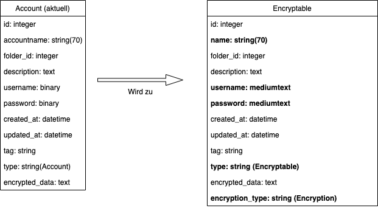

# Datenbank Migration

Mit der neuen Struktur der encryptables fällt die aktuelle Accounts tabelle weg. Mittels einer Single Table Inheritance ([Rails STI](https://api.rubyonrails.org/classes/ActiveRecord/Inheritance.html)) werden die submodels `Encryptable::File`, `Encryptable::Credentials` und `Encryptable::OSESecret` dem `Encryptable` zugeordnet.

## Änderungen

_Neue Encryptable Tabelle; Änderungen in Fett dargestellt._

| Änderung                               | Beschreibung                                                                                                                                                                       |
| -------------------------------------- |:----------------------------------------------------------------------------------------------------------------------------------------------------------------------------------:|
| `name: string(70)`                     | Attribut wurde umbenannt.                                                           |
| `username: mediumtext`                 | Der Username des Accounts. Wird auf Encryptable Tabelle mit neuem Datentyp `mediumtext` abgespeichert.                                 |
| `password: mediumtext`                 | Passwort des Accounts. Wird auf Encryptable Tabelle mit neuem Datentyp `mediumtext` abgespeichert.                                            |
| `type: string (Encryptable)`           | Dieses Attribut definiert den Encryptable Typ.                                                                                                           |
| `encryption_type: string (Encryption)` | Dieses Attribut definiert den vewendeten Verschlüsselungsalgorithmus. |

## Ablauf

Die Datenbankmigration bennent die Accounts-tabelle zur Encryptable-tabelle um, so wird sichergestellt, dass die Primary Keys dieselben bleiben. Zwecks Rückwärtskompatibiliät können damit auch alte API aufrufe den richtigen Accounts zugeordnet werden. Die Benutzerdaten werden mithilfe von zwei `EncryptedData` Klassen, der `EncryptedData::Credential` und `EncryptedData::File` verschlüsselt abgespeichert, dabei sollte der Datentyp Blob möglichst durch einen string Datentyp ersetzt werden, vorzugsweise `mediumtext`.
