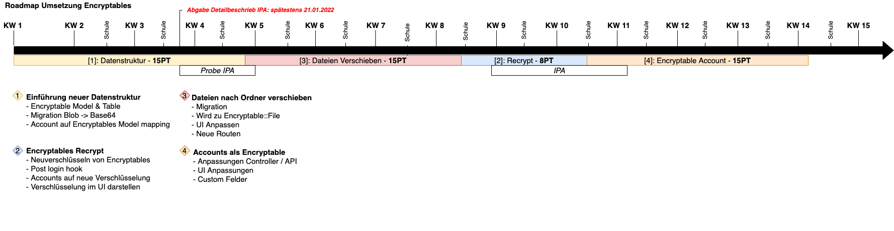

# Umsetzung
Für die Umsetzung wurden vier Teilpakete erstellt, welche Unterschiedliche Änderungen als Ziel haben.

_Darstellung der Umsetzung (Roadmap)_

## Teilpaket 1
Das erste Teilpaket beinhaltet die Einführung der neuen Encryptable Struktur. Das heisst das die aktuellen `Blob` Felder auf jene mit `MediumText` migriert werden. Dies bietet den Vorteil, dass `Base64` codierte werte Ressourcenschonend abgespeichert werden können. Desweiteren  wird ein Mapping vom bestehenden Account auf das Encryptable Model erstellt.

## Teilpaket 2
Das zweite Teilpaket beinhaltet den Encryptables Recrypt. Dieser wird die Encryptables neu verschlüsseln und dabei den neuen Verschlüsselungs Algorithmus mit `iv` einführen (Siehe mehr unter [Verschlüsselung mit IV](1.1_encryptables_model.md#verschlsselung)). Mittels einem post login hook werden die Encryptables auf eine neue/bessere Verschlüsselung recrypted. Zusätzlich wird im UI die verwendete Verschlüsselung dargestellt.

## Teilpaket 3
Das dritte Teilpaket umfasst die Verschiebung der Dateien von den Accounts zu den Ordnern. Dafür wird eine Migration erstellt welche die Dateien zum Typ `Encryptable::File` migriert. Dazu muss das UI angepasst werden und neue Routen erstellt werden.

## Teilpaket 4
Im vierten Teilpaket werden die Controller und API änderungen vorgenommen. Dabei werden auch die Custom felder eingebaut und im UI erstellt.