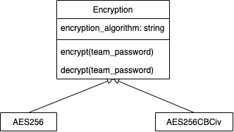

# Verschlüsselung

## Ausgangslage
Neue Verschlüsselungsalgorithmen wurden mit neuen Versionen eingeführt. So wurden alle Accounts neu  verschlüsselt nachdem sich der Benutzer zum ersten mal auf einer neuen version angemeldet hat. 

## Neuer Ansatz
Mit Hilfe eines post login hooks* sollen die Accounts welche noch nicht mit dem neusten Verschlüsselungalgorithmus verschlüsselt wurden, erkennt und erneut verschlüsselt werden. Neue Verschlüsselungen kann man in der Rails config von Cryptopus spezifizieren. 

\* Der post login hook wird ausgeführt sobald sich ein Bentuzer das erste mal nach einem Cryptopus update erfolgreich angemeldet hat. 
## Umsetzung
Die 'Standart' verschlüsselung soll in der Rails config angegeben werden können. Encryptables welche neu erstellt werden, verwenden den dort eingetragenen Verschlüsselungsalgorithmus. Zusätzlich soll im UI die vom Team verwendete Verschlüsselung dargestellt werden, dies sorgt für mehr Transparenz sowie auch Sicherheit gegenüber den Bentuzer.

### Recrypt Controller
Der `Api::Teams::RecryptController` wird verwendet damit Teams auf einen anderen Verschlüsselungs Algorithmus wechseln können. Dieser wird vom post login hook aufgerufen. Sobald dies geschieht, werden alle Encryptables welche sich in diesem Team befinden, mit dem neuen Algorithmus verschlüsselt. Die Encryptables werden mithilfe der Encryption Struktur, auf die entsprechende Verschlüsselung recrypted.

## Encryption Struktur

_Neue Encryption Struktur_

Mithilfe dieser Verbung wird sichergestellt, dass in Zukunft neue Verschlüsselungen einfach eingeführt werden können. Desweiteren dienen die Encryption Klassen um die gewählte Verschlüsselung für ein Team zu aktualisieren. Einerseits werden die Klassen für eine Neuverschlüsselung der Teams verwendet und andererseits zum verschlüsseln von neuen Encryptables.
